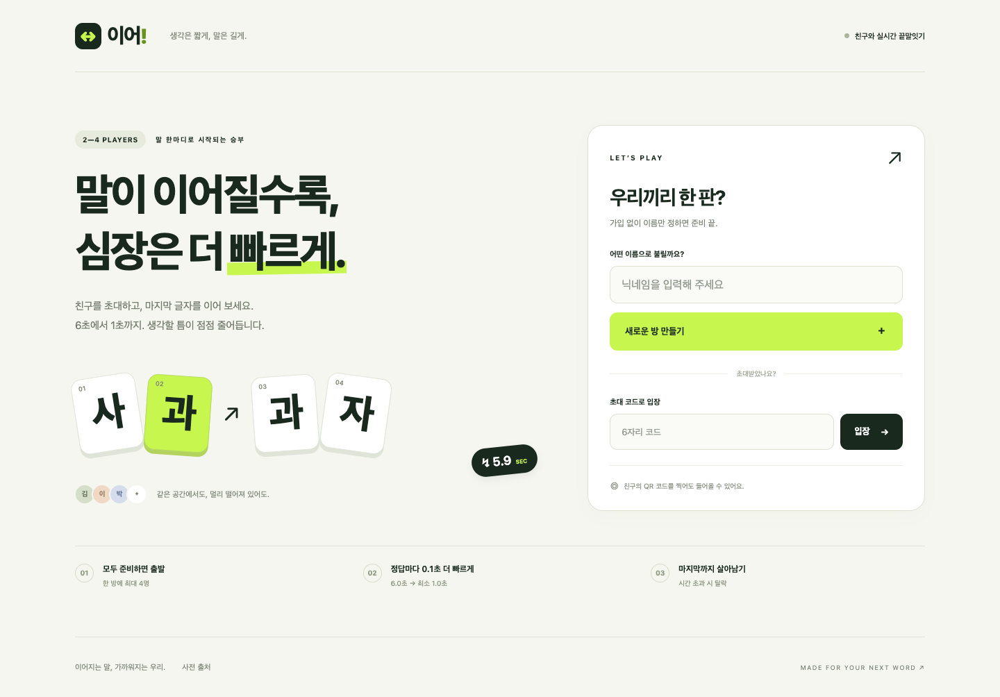

# 이어 · Wordrelay

2–4명이 같은 방에서 즐기는 실시간 끝말잇기 웹 게임입니다. 방을 만들고 QR 또는 6자리 코드로 초대합니다. 모두 준비한 뒤 방장이 시작합니다.

**제한 시간은 6.0초에서 시작해 정답마다 0.1초 감소하며, 최소 1.0초입니다.** 서버가 정답·차례·마감 시간을 판정합니다.



## 구성

- **서버:** Rust + Axum + Tokio. 방마다 독립된 actor와 유한 메시지 큐를 사용합니다. 같은 방의 이벤트는 순서대로 처리하고 서로 다른 방은 독립적으로 실행합니다.
- **통신:** 표준 WebSocket. 연결 유지 확인, 자동 재접속, 세션 복원, 느린 연결 제한, 상태 스냅샷 동기화.
- **클라이언트:** TypeScript + Vite + 직접 DOM 렌더링. 별도 UI 프레임워크 없이 작은 번들을 제공합니다. 모바일 한글 조합 입력을 고려했습니다.
- **정답:** 서버 메모리에 한 번만 읽는 통합 사전 411,845개. 국어 명사·롤 챔피언·클래시 로얄 카드·애니 제목을 모드 구분 없이 인정합니다. 게임 화면에서 뜻, 인정 근거, 출처를 펼쳐 볼 수 있습니다.

성능의 절대적인 “최고”를 주장하지 않습니다. 이 게임의 짧은 메시지와 4인 방에는 WebSocket으로 충분하며, UDP·WebRTC·WebTransport의 추가 복잡성 없이 서버 판정 순서와 브라우저 호환성을 유지합니다.

## 실행

Rust stable(1.88 이상), Node.js 22.12 이상 또는 24 LTS가 필요합니다. `Cargo.lock`과 `package-lock.json`을 함께 사용합니다.

```sh
npm ci
npm run build
cargo run --release --locked
```

[http://localhost:3000](http://localhost:3000)에서 열립니다. 다른 휴대폰으로 QR 입장을 테스트하려면 **같은 Wi-Fi에서 컴퓨터의 LAN IP 주소**로 접속하세요. 예: `http://192.168.0.10:3000`. localhost QR은 다른 휴대폰에서 컴퓨터를 가리키지 않습니다.

개발 중에는 별도 터미널에서 `cargo run`과 `npm run dev`를 실행합니다. Vite의 5173 포트가 `/ws`와 `/api`를 Rust 서버로 프록시합니다. 호스트 이름이 다른 개발 프록시를 쓸 때는 허용할 `PUBLIC_ORIGIN`을 명시하세요.

## 규칙

1. 한 방 최대 4명, 최소 2명. 방장을 포함한 모든 참가자가 준비해야 방장이 시작할 수 있습니다.
2. 3초 카운트다운 후 무작위 선공과 시작 단어를 제시합니다. 입장 순서대로 살아 있는 참가자의 차례가 돌아옵니다.
3. 서버에 도착한 정답을 기준으로 `max(1000, 6000 - 정답수 × 100)` 밀리초를 다음 차례에 적용합니다. 첫 차례 6초, 첫 정답 후 5.9초, 50번째 정답 후부터 1초입니다. 부동소수점 오차가 없습니다.
4. 오답은 시간을 줄이거나 초기화하지 않습니다. 제한 시간 안에 재입력할 수 있습니다. 이전 차례의 지연·중복 제출은 `turnId`로 거절합니다. 마감 시각과 같은 시각에 처리되는 답은 시간 초과입니다.
5. 시간 초과면 탈락해 관전합니다. 마지막 한 명이 라운드에서 승리해 300점을 받습니다. 설정한 라운드를 모두 마치면 누적 점수로 최종 우승을 정합니다. 탈락 후에는 새 시작 단어로 이어가고 누적 제한 시간은 유지합니다.
6. 한방 단어도 정답입니다. 사전에서 미사용 후속 단어가 없으면 탈락 없이 새 시작 단어로 전환합니다. 새 시작 단어도 사용 기록에 남습니다.
7. 한 글자, 공백·문장부호를 제거한 표기, 등록된 한글 읽기를 인정합니다. 두음법칙은 정방향만 적용합니다. 같은 정답은 다시 사용할 수 없습니다.
8. 진행 중 신규 입장은 불가합니다. 같은 브라우저 탭 새로고침·일시적 연결 끊김은 기존 비밀 토큰으로 자리를 복원합니다. 연결이 끊겨도 게임 시간은 멈추지 않습니다.
9. 연결이 끊긴 자리는 6초 동안 복구할 수 있으며 이후 자동 퇴장합니다. 방장이 끊기면 연결된 다음 참가자에게 방장을 넘깁니다. 참가자 구성이 바뀌면 준비를 다시 합니다.
10. 직접 나가면 즉시 탈락합니다. 종료 후 방장이 ‘다시 준비하기’를 누르면 연결된 참가자와 같은 방에서 다시 준비합니다.

브라우저의 타이머는 서버 시각과 왕복 지연을 바탕으로 보정한 표시용입니다. 판정은 서버의 단조 시계(`Instant`)를 사용하므로 시스템 시각 변경이나 클라이언트 시계 조작으로 시간을 늘릴 수 없습니다. 특히 최소 1초 구간에서는 물리적인 네트워크 지연의 영향이 있으므로 가까운 리전에서 운영하는 것이 좋습니다.

## 배포

Render에서는 Docker 웹 서비스, 싱가포르 리전, Free 요금제, 상태 검사 `/api/health`를 사용합니다. `render.yaml`에 같은 설정이 있습니다. Render의 `PORT`와 `RENDER_EXTERNAL_URL`을 자동 사용합니다. 무료 인스턴스는 비활성 시 중지되어 첫 접속이 늦을 수 있습니다.

```sh
docker compose up --build -d
```

Dockerfile은 정적 클라이언트와 Rust 실행 파일을 하나의 이미지로 묶습니다. 런타임은 비특권 사용자로 실행합니다. HTTPS는 Caddy/Nginx 또는 호스팅 서비스에서 종료하고 WebSocket 업그레이드를 전달하세요. 예시는 `Caddyfile.example`에 있습니다.

| 변수 | 기본값 | 용도 |
|---|---|---|
| `BIND_ADDR` | `0.0.0.0:${PORT}` | 수신 주소. PORT 미지정 시 3000 |
| `PUBLIC_ORIGIN` | `RENDER_EXTERNAL_URL` 또는 요청의 동일 출처 | 배포 시 실제 HTTPS origin. QR과 WebSocket 출처 검사에 사용 |
| `DICTIONARY_PATH` | `data/dictionary.json` | 통합 사전 |
| `STATIC_DIR` | `dist` | 빌드한 클라이언트 |
| `RUST_LOG` | `wordrelay=info` | 로그 수준 |

`PUBLIC_ORIGIN=https://word.example.com`처럼 경로 없는 origin을 지정합니다. `.env.example`은 참고용이며 프로그램이 `.env` 파일을 자동으로 읽지는 않습니다.

**현재는 단일 서버 프로세스용입니다.** 방은 메모리에 있으므로 서버 재시작 시 종료됩니다. 서버당 최대 128개 방·1024개 WebSocket 연결, 빈 방 60초 및 비활성 방 30분 정리, 입력 프레임 4KB·초당 메시지 수 제한이 적용됩니다. 대규모 운영 시에는 방별 고정 라우팅이나 방 소유자를 관리하는 계층을 추가해야 하며, Redis를 붙이는 것만으로 여러 인스턴스가 같은 방을 공유하지는 않습니다. 공개 운영의 사용자/IP별 방 생성 제한과 도메인·TLS 설정은 운영 환경에서 추가할 수 있습니다.

## 검증

```sh
cargo fmt --check
cargo test --locked
cargo clippy --locked --all-targets -- -D warnings
npm run build
# 서버를 3000 포트에 실행한 뒤:
npm run test:protocol
npx playwright install chrome
npm run test:e2e
```

- Rust: 시간 경계, 최소 제한 시간, 턴·중복·오답, 준비·정원·방장, 재접속, 한방 단어, 재대결, 토큰 비노출.
- 프로토콜: 실제 4인 WebSocket으로 55개 정답 제출, 5인째 거절, 1초 하한, 세션 교체, 승리, 재대결.
- 브라우저: 데스크톱·모바일 독립 세션에서 QR 표시, 입장·준비·시작·답 제출·설명·새로고침·종료, 레이아웃 넘침 검사.
- CI: 빌드와 위 검사 실행.

## 사전

`data/ATTRIBUTION.md`에 출처와 라이선스가 있습니다. 국립국어원 한국어기초사전·우리말샘 뜻풀이의 파생 데이터는 **CC BY-SA 2.0 KR** 조건을 유지합니다. 게임·애니 설명은 직접 작성했으며 원문 소개문·이미지를 배포하지 않습니다. 애니는 선정된 45개 작품이며 모든 작품을 망라하지 않습니다. 사전 버전은 서버 시작 시 고정되며 `data/stats.json`, `data/import-report.json`으로 범위와 원본을 확인할 수 있습니다.

## 파일

```text
server/src/dictionary.rs  정답 인덱스와 두음법칙
server/src/game.rs        순수 게임 규칙·상태 및 단위 테스트
server/src/main.rs        방 actor·WebSocket·HTTP
client/src/main.ts        입장·대기방·플레이·결과 UI
client/src/style.css      반응형 스타일
client/public/           파비콘·출처 안내
tests/                   프로토콜 및 브라우저 검사
data/                    정답 사전·출처·수집 기록
```

## 강퇴·엔터 입력·역 이름

- 방장은 대기방과 게임 화면에서 다른 참가자의 ‘강퇴’를 눌러 내보낼 수 있습니다. 게임 중에는 탈락 처리하며, 현재 차례라면 다음 차례로 진행합니다. 기존 재접속 토큰은 무효입니다. 로그인 없는 서비스여서 새 참가자로 다시 입장하는 것까지 차단하는 영구 이용 정지는 아닙니다.
- PC Enter와 모바일 키보드 전송/줄바꿈 동작을 지원합니다. 한글 조합 중 Enter는 조합 완료 후 한 번 제출합니다.
- 공식 안내에서 확인한 역 이름 585개를 통합 사전에 포함합니다. 서울역·부산역·강남역·홍대입구역 등이 해당하며 각 항목에 설명·인정 근거·출처가 있습니다. 임의의 단어에 ‘역’을 붙이는 방식은 인정하지 않습니다.
- 역 데이터 갱신: `python3 scripts/import_stations.py`. 저장한 목록으로 재생성: `python3 scripts/import_stations.py --cached`.

## 라운드와 점수

방장이 대기방에서 1~10라운드(기본 3)를 설정합니다. 설정 변경 시 준비가 해제됩니다. 각 라운드는 3초 카운트다운 뒤 6초로 시작하며, 정답마다 0.1초 감소해 최소 1초가 됩니다. 단어 사용 기록과 생존 상태는 매 라운드 초기화합니다.

정답 점수 = 100 + 20 × (등록 한글 읽기의 글자 수 − 1) + floor(200 × 남은 시간 / 해당 차례 제한시간). 서버 도착 시각으로 계산하며, 공백·기호·별칭으로 점수를 늘릴 수 없습니다. 예: 4글자를 제한시간 절반에 제출하면 260점.

탈락 감점 = min(150, floor(이번 라운드 획득 점수 × 0.2)). 이전 라운드 점수를 보존하고, 0점 미만으로 내려가지 않으며 탈락 후 퇴장해도 중복 차감하지 않습니다. 시간 초과·경기 중 퇴장·강퇴에 같은 규칙을 적용합니다. 라운드 마지막 생존자에게 300점 보너스를 줍니다.

라운드 종료 후 4초간 결과를 표시하고 다음 라운드로 자동 진행합니다. 최종 누적 점수 1위가 우승하며 동점은 공동 우승입니다. 퇴장한 참가자는 최종 우승 대상에서 제외합니다. 퇴장으로 남은 참가자가 2명 미만이면 조기 종료하고 현재 점수로 결과를 표시합니다.

연결 끊김 감지 후 6초 안에 복구되지 않으면 서버에서 자동 퇴장합니다. 클라이언트도 복구 시도 시작 후 6초가 지나면 홈으로 돌아갑니다. 1초 주기 애플리케이션 연결 신호를 사용하며 서버는 마지막 신호 후 6초가 지나면 퇴장 처리합니다(1초 주기 확인). 프록시의 WebSocket 응답만으로 접속을 유지하지 않습니다.

### 우리말샘 확장 데이터 재생성

`data/dictionary.json`의 `supplements`에 등록된 `opendict.json.gz`를 서버가 시작할 때 함께 읽습니다. 압축 자료는 전체 XML에서 추출한 추가 명사 표기와 대표 뜻풀이이며, 기존 게임·역·작품 데이터는 유지합니다. 원본 스냅샷과 필터별 집계는 `data/opendict-import-report.json`에 있습니다. 사전 전체 항목 수와 게임에서 인정하는 고유 표기 수는 다릅니다.

원본 디렉터리에 GitHub tree 응답의 `commit`, `files`(path/size/sha)를 기록한 `manifest.json`과 해당 XML 파일을 준비한 뒤 `python3 scripts/import_opendict.py /path/to/opendict`를 실행합니다. 스크립트는 Git blob SHA-1과 크기를 검증하고 SHA-256을 보고서에 기록합니다. 역 데이터를 갱신하는 경우 역 importer 실행 후 우리말샘 importer를 다시 실행하여 중복 및 통계를 갱신합니다.
